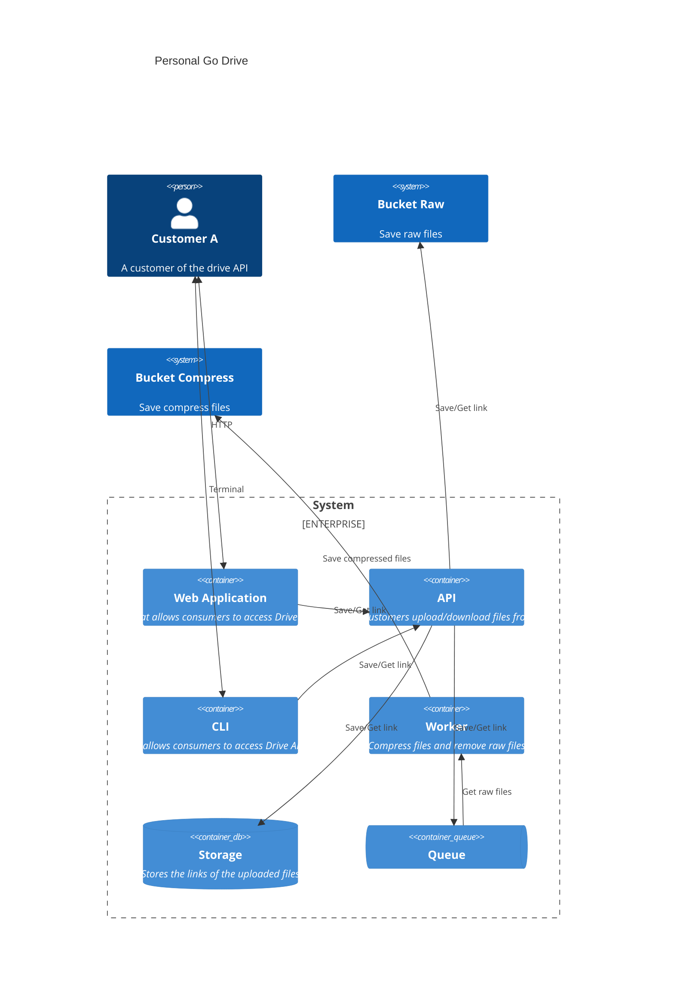
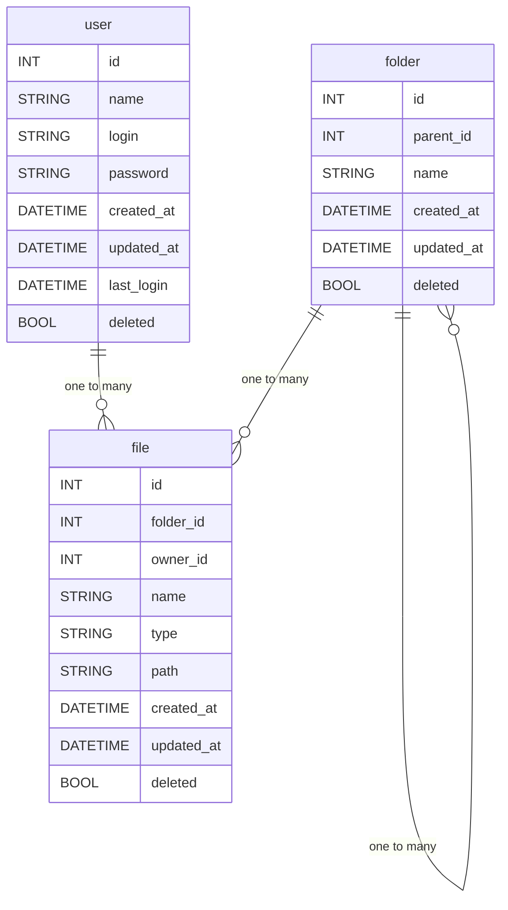

<a name="readme-top"></a>

# <p align="center">agl-go-driver</p>

<p align="center">
    
</p>

## 💬 About

This project was developed following Aprenda Golang's "[Imersão Backend](https://aprendagolang.com.br/courses/imersao-backend)" course.

Notes taken during the course are in the [notes](notes.md) file.
Architecture:

## :art: Architecture

> [!NOTE]
> 1. The following diagram was generated using [Mermaid](https://mermaid-js.github.io/mermaid/).  
> 2. It is a C4 model diagram at the container level, see more at [C4 Model](https://c4model.com/).




## :card_file_box: Database



## :computer: Technologies

- [Go](https://golang.org/)
- [RabbitMQ](https://www.rabbitmq.com/)
- [Docker](https://www.docker.com/)

<p align="right">(<a href="#readme-top">back to top</a>)</p>

## :scroll: Requirements

- [Go](https://golang.org/)
- [Docker](https://www.docker.com/)

<p align="right">(<a href="#readme-top">back to top</a>)</p>

## :cd: Installation

```sh
git clone git@github.com:filipe1309/agl-go-driver.git
```

```sh
cd agl-go-driver
```

<p align="right">(<a href="#readme-top">back to top</a>)</p>

## :runner: Running

```sh
make run
```

> Access http://localhost

<p align="right">(<a href="#readme-top">back to top</a>)</p>

<!-- ## :white_check_mark: Tests

After up the container:

```sh
docker-compose exec -t {{ CONTAINER_SERVICE_NAME }} ./vendor/bin/phpunit
```

## Contributing

Pull requests are welcome. For major changes, please open an issue first to discuss what you would like to change.

Please make sure to update tests as appropriate. -->

## :pin: Roadmap
- [ ] replace `aws-sdk-go` with `aws-sdk-go-v2`

license:
## :memo: License

[MIT](https://choosealicense.com/licenses/mit/)

<p align="right">(<a href="#readme-top">back to top</a>)</p>

## 🧙‍♂️ About Me

<p align="center">
    <a style="font-weight: bold" href="https://github.com/filipe1309/agl-go-driver/">
    
    </a>
</p>

<p align="right">(<a href="#readme-top">back to top</a>)</p>

## :clap: Acknowledgments

- [ShubcoGen Template™](https://github.com/filipe1309/shubcogen-template)

<p align="right">(<a href="#readme-top">back to top</a>)</p>

---

<p align="center">
    Done with&nbsp;&nbsp;♥️&nbsp;&nbsp;by <a style="font-weight: bold" href="https://github.com/filipe1309/">filipe1309</a> 🖖
</p>

---

